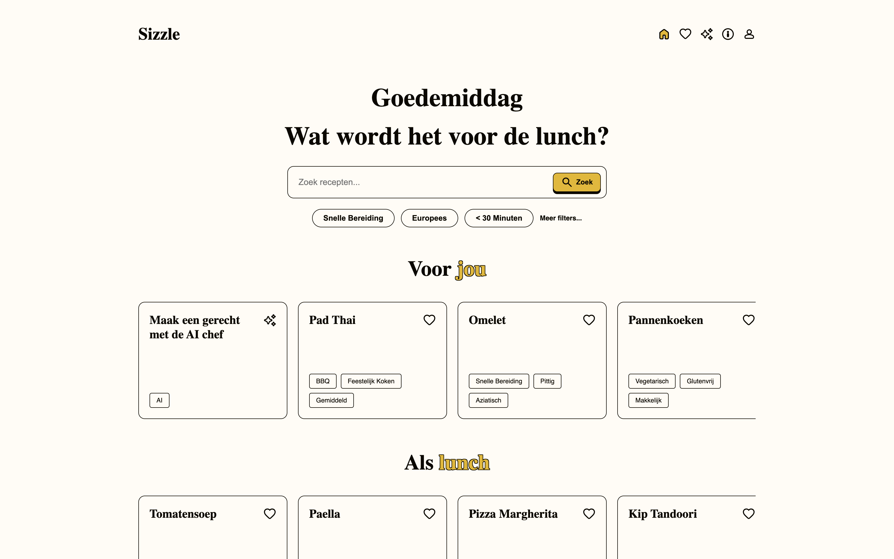
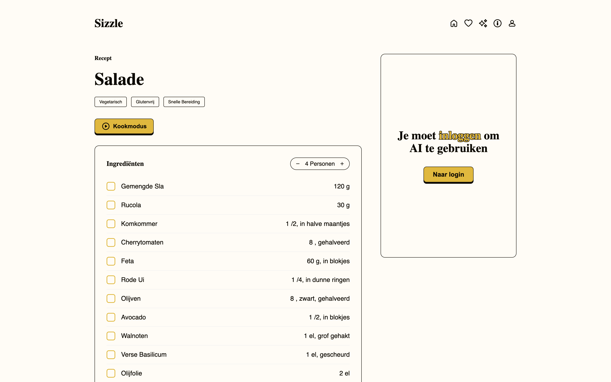
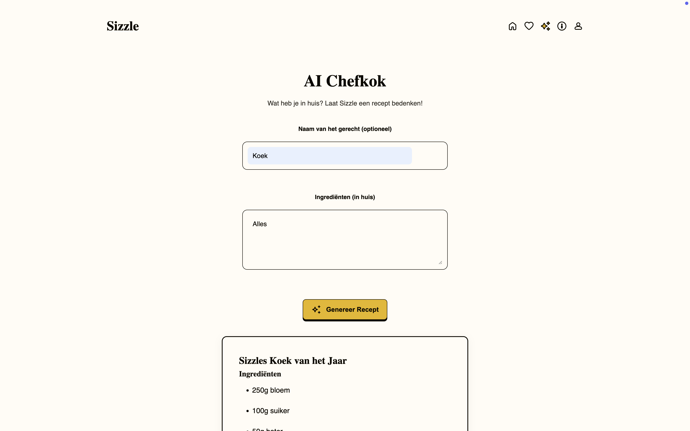
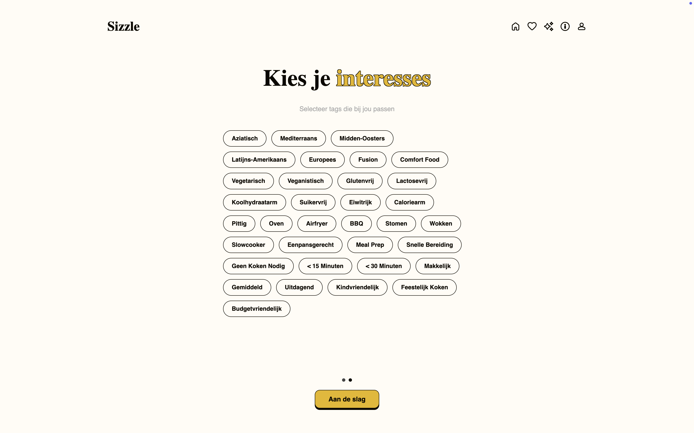
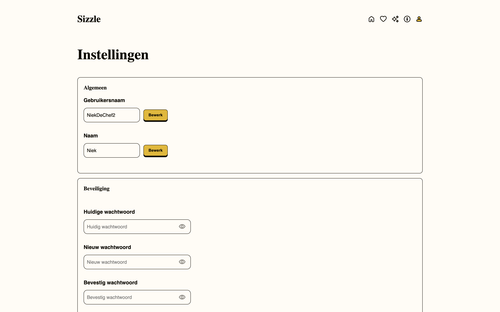
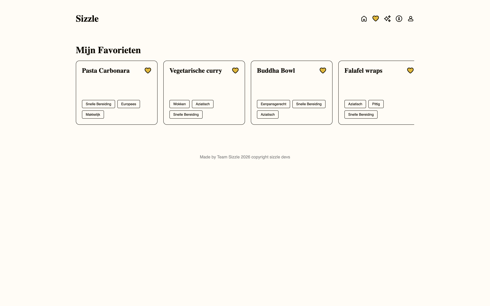
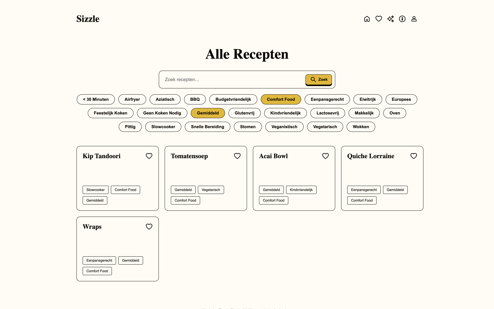

# Sizzle — De ultieme kookhulp

Sizzle helpt gebruikers nieuwe recepten te vinden, recepten te bekijken, favorieten bij te houden en recepten te genereren of vragen te stellen aan de AI-kok. De frontend bestaat uit statische HTML/CSS/JS-bestanden in de `webapp/` map; de backend levert REST API-endpoints voor recepten, authenticatie, favorieten en aanbevelingen.

> ## Onze website is beschikbaar op: https://sizzledev.tech/


## Inhoud van dit project

- `webapp/` — statische frontend (HTML, CSS, JS, afbeeldingen)
- `src/` — React-achtige componenten en pagina's (onderdelen van de ontwikkeling)
- `README-foto's/` — plaats hier screenshots die je in deze README wilt tonen
- Backend (extern gehost) — levert de API die de frontend gebruikt, bekijk de repo: https://github.com/SizzleDevs/Sizzle_backend

---

## Hoe de webapp werkt

1. De gebruiker opent een pagina uit `webapp/` (bijv. `index.html`, `recipe.html`, `ai-chef.html`).
2. De frontend maakt verzoeken naar de backend-API (URL ingesteld in `webapp/config.js`).
3. Authenticatie gebeurt via JWT-tokens die in `localStorage` worden bewaard; de frontend voegt de token toe aan API-aanvragen.
4. Recepten, favorieten en aanbevelingen worden via de API geladen en getoond in de UI.

Belangrijke bestanden:

- `webapp/config.js` — bepaalt `API_BASE_URL` en bevat functies en endpoints (bijv. `RECIPES`, `FAVORITES`, `LOGIN`, `REGISTER`).
- `webapp/home.js`, `webapp/recipe.js`, `webapp/ai-chef.js`, `webapp/ai-recept.js` — belangrijkste JS-logica voor respectievelijke pagina's.
- `webapp/auth.js` — login/registratie en sessiebeheer.
- `webapp/styles.css`, `webapp/dark.css`, `webapp/theme.js` — styling en thema's.

> Omdat wij de gratis versie van Render gebruiken voor onze backend, heeft de backend na inactiviteit een minuut nodig om weer op te starten, dus verwacht dat de recepten/andere functies niet direct laden. Altijd nadat de servers zijn opgestart werkt alles wel direct.

---

## Screenshots

De volgende screenshots staan momenteel in `README-foto's/` en zijn klaar om hier te worden weergegeven:

- `homepage.png` — Startpagina / overzicht



- `recept-detail.png` — Recept detailpagina



- `ai-chef.png` — AI Chef / recept-aanvraag



- `login.png` — Login-scherm



- `profile.png` — Profiel



- `favorites.png` — Favorieten lijst



- `search-filter.png` — Zoek- en filterresultaat



- `sizzle Mockup.png` — Mockup / cover-afbeelding


## Website openen
```
cd webapp
python3 -m http.server 8000
# Open http://localhost:8000 in je browser
```

of

Ga naar: https://sizzledev.tech/


Let op: als je de publieke backend (Render) gebruikt kan die bij eerste verzoek na inactiviteit even opwarmen (zie opmerking hierboven).

---

## Deploy & backend

- De frontend is statisch en kan op elke statische host geplaatst worden.
- De backend staat (standaard) op Render; kijk in `webapp/config.js` voor de default URL (`https://sizzle-backend-9mad.onrender.com`).
